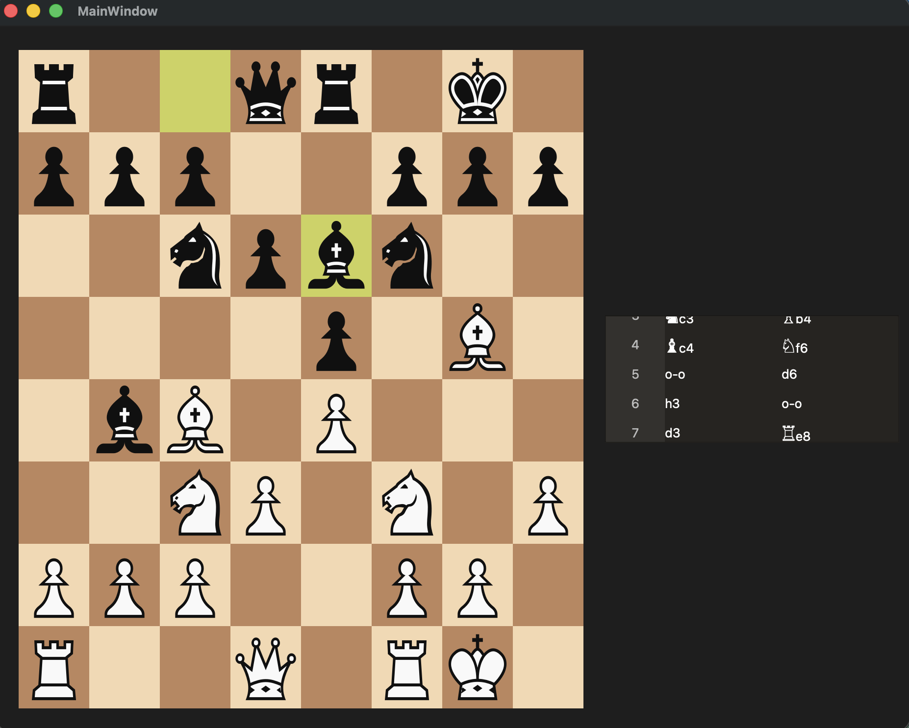

# chess-qt
Bare bones Qt chess application. Validates moves according to the standard rule set including but not limited to: castling, pawn promotion, enpassant. UI is borrowed and/or modeled from lichess. 



# Prerequisites
- OS: macOS Tahoe 26.5
- Qt: 6.11.1

# Build & Run
Create Build Directory:
```bash\
mkdir -p ./build/
```
First Time Build:
```bash\
cmake -S . -B build -G Ninja -DCMAKE_PREFIX_PATH="$HOME/Qt/6.11.1/macos"
```
Build:
```bash\
cmake --build build
```
Run App:
```bash\
./build/app/chess_app
```
Run Unit Test:
```bash\
./build/tests/unit_tests
```

# Features
- Move Validation: Legal Move, Legal Capture
- Special Moves: Castling, Pawn Promotion, Enpassant
- Checkmate/Stalemate Detection
- Move Recording
- UI Highlight: Previous Move, Possible Move Options, King Check

# TODO
- Timer
- 50-Move Rule
- Threefold Repetition
- FEN Display
- Drag & Drop Pieces

# Showcase

